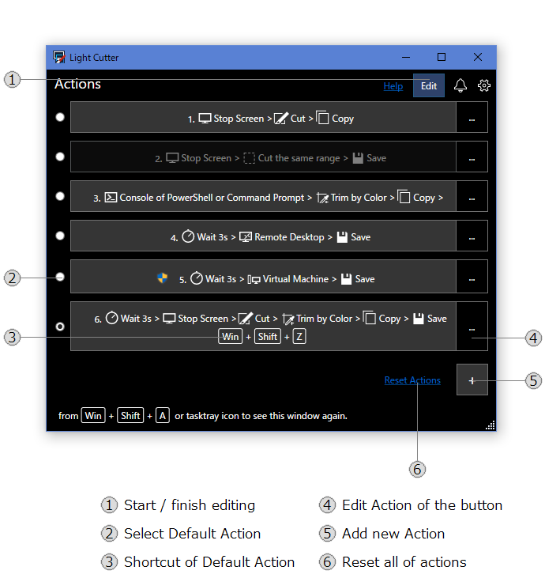
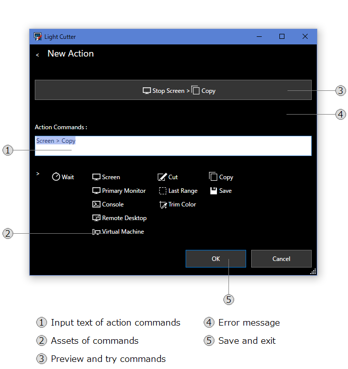

# How to Edit Action
You can edit Actions in version.7.1 or later. 



1. Click Edit button on the actions page to start editing. And also click to finish.
2. Select radio button to select Default Action. 
3. Shortcut key is shown in the Action which is selected as Default Action.
4. Click to edit a action which is aleady added on the list of actions. Delete the action also in here. 
5. Click to add new action. see the following page.
6. Click to reset actions. All customized items of list are deleted, and then simple commands are shown in list.

- Can not change order of list, in this version.



 1. Action is specified by simple command text. Input text into text box directly or click assets to insert into here.
 2. Threre are some buttons of Assets. Click button to input text of command into Action Commands text box.
 3. When Action Commands text is changed, preview Action Button is shown to click to try its command text.
 4. If error is occured to try command text, error message is shown here.
 5. Click to save. And then back to Actions page.

 - Delete Button is shown in Editing Action page. click to delete the action.

## Format of Action
A Action has some of commands. Split commands by character of ">".  These commands are called in order by left.

*Command1* > *Command2* > *Command3* 

```
Screen > Cut > Copy
````

A Command has a type. Some of type of commands require the result of before command. Fore example, Cutting, Editing or Sharing commands can be called after Target commands. Operation commands can called anytime.

*Operation* > *Target* > *Cutting* > *Editting* > *Sharing*

```
Wait > Screen > Cut > Trim Color > Copy 
````
Also same type commands can be called sometimes.

```
Screen > Copy > Save
````
If you cancel one of command, all other commands are not called. File and Cut can be canceled. If Target is not found, action stop too.

## Operation Commands
### Wait *3*s 
```
Wait
```
This is delay command. When this command is called, wait some times for your operation. During the time, you can use other windows software and show the screen that you want to capture.

You can change wait time in setting page.

## Target Commands

### Stop Screen 
```
Screen
```
Capture all screens.

### Primary Monitor 
```
Primary Monitor
```
Capture primary monitor. If count of monitor is one then this command is same as Stop Screen command.

## Cutting Commands

### Console of PowerShel or Command Prompt
```
Console
```
Capture inside of console app. When console of PowerShell or Command Prompt is shown, you can capture these app.

This command can capture image of the app, even if the window of the app is in under the other windows.

### Remote Desktop
```
Remote Desktop
```
Capture inside of Remote Desktop Connection. When this window is shown, you can capture its connection's desktop.

This command can capture image of the app, even if the window of the app is in under the other windows.

### Virtual Machine
```
Virtual Machine
```
Capture inside of Virtual Machine Connection of Hyper-V. When this window is shown, you can capture its connection's desktop.

This command can capture image of the app, even if the window of the app is in under the other windows.

### File Image
```
File
```
Open a image file.

### Clipboard Image
```
Clipboard
```
Get a image from clipboard. After a image is copied from the other app, you can get image as like "paste".

## Editting Commands

### Cut 
```
Cut
```
Crop a image which is got from target by mouse. 

When this command is called, show a image in full screen.
Specify bounds by mouse as like drag and drop.

### Cut the same range
```
Last Range
```
Crop a image which is got from target by a bounds as which is same as last time. 

This command cannot be called before Cut command is called.
The bounds is not saved after this app restart.

### Trim by Color
```
Trim Color
```
Trim a image which is got from target by color. 

This command gets colors of the edge of the image.
Trim the image to remove the edge of the same color.

For example, use this command after Console command.
You can get a picture of only the range in which the text is displayed. 

Another example, use this command after File command.
You can trim the image.

## Sharing Commands

### Copy
```
Copy
```
Copy a image to clipboard.

You can use images on other apps.

### Save
```
Save
```
Save a image as file.

The file is saved in Default Folder. Default Folder can be changed in settings page.

### Open Saved File
```
Open
```
Open a image file which is saved by using Save command. 

If a image is not saved yet, a image is saved in temp folder of Windows system to open.

You can change app which open a image by Setting of Windows.

