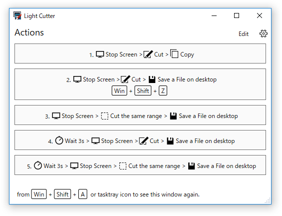

# How to use Light Cutter 7.1
 

Light Cutter is a simple screenshot utility. 

## See  also

- [How to Edit Action](HowToEditAction.md)

## Installation and Run
Download installer package from [here](https://github.com/surviveplus/Light-Cutter/releases)  and run setup.exe in the zip file.
Click shortcut of Light Cutter in Windows Start menu to run. Otherwise after restarting Windows, this app will run automatically.  

If this window is closed aleady, you can open this window again by  shortcut key  or right-click menu of task tray icon.

The default shortcut key is "Ctrl + Shift + Alt + A" and it is customizable in the [setting](#Settings) page.

## Quick start
In this app window, click a action button to capture screenshot.

If you click "1. Stop Screen > Cut > Copy" button, screen image is stopped soon, and you can select a range of screen.

Click and keep the mouse button down to select range of screen.

Release the mouse button to determine the range, and then a screenshot is copied.
Otherwise, press Esc key or right-click to cancel capture.

If you choose another action, you can do something during the wait time before the screen capture, or the captured image will be saved to the file.
You can also capture the same range as the last range several times.
Choose the best action for your situation.

## Default Action

You can select a action more quickly by using default action.
Default action is started by shortcut or double click tasktray icon.
Default shortcut is "Ctrl + Shift + Alt + Z", you can change shortcut in [setting](#Settings) page.

Click "Edit" button on actions window to change default action. 
Select one of actions in this view.

## Settings
Click the gear icon to change the settings.

You can change settings, like wait time and shortcut keys, in this page.
