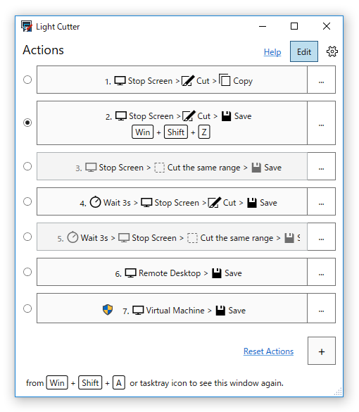

# Light Cutter

 

Light Cutter is a screenshot utility in Windows 3.1 and later, including Windows 10.
It can take screenshots of an rectangular area by using a mouse.
You can start this with shortcut key or delay.
Can capture the same area as last time, so you can capture it fast and continuously.

 

 - [Light Cutter ver.7.1 (Preview)](https://github.com/surviveplus/Light-Cutter/releases)
 - [Light Cutter ver.7.0](https://github.com/surviveplus/Light-Cutter/releases/tag/ver.7.0.33.18)
 - [Light Cutter ver.5.4](
http://www.surviveplus.net/ja/archives/24
) ( Japanese Only )

In Japan, users of this software series are over 50,000 people total. For example, one of company approved it as official software.
However, the new version had not been released recently. So in this repository we migrate this and release new features.

## How to use (Quick Start)
see [here](HowToUse/HowToUse.md)

### Action Command Edit (Ver.7.1)

You can edit Actions in version.7.1 or later. 

Action is specified by simple command text.

## Roadmap
### ver.7.0 - Migrating from previous version
Light Cutter ver.5.4 is Visual Basic 6.0 (unmanaged) based app with using .net COM classes (managed).
Even in Windows10, this version is limited but works.
First we are migrating from this version.
The new version supports high DPI in addition to previous features.

### ver.7.1 - Split commands to support new targets
Now we specify the area from the full screen.
The new version will allow you to automatically find specific apps and areas.
This feature has already been done in the [prototyping code](https://github.com/surviveplus/Light-Cutter/tree/master/prototype/InsiderCutterPrototype).

In addition to copying captured images to the Clipboard or saving them as images on the desktop, you can share them with others.

We want to be able to use these new features in combination with existing features. So we re-design the command to be split.
A new UI is provided for the new commands.
The commands would also be possible to call from the command prompt or other programs.

### ver.7.2 - Bots, Web services, and As Skills
The commands will also be able to call from another device or app beyond the Internet.
For example you can capture a screen without a mouse operation by speaking a command to a bot.
We need a delay now, but in the future, we will be able to use our voice instead.

### ver.7.3 - Smart (AI)
The new version will be smarter and easier to use.
Our friend always said, "I am glad that I can capture it as I thought more".
AI should be able to automatically determine capture scenarios and help more.

## Contributing
 - When you find bugs in [the released version](https://github.com/surviveplus/Light-Cutter/releases), report it to the [issues](https://github.com/surviveplus/Light-Cutter/issues).
 - The new feature will be prototyped first. 
 Look at the [issues](https://github.com/surviveplus/Light-Cutter/issues) and [code](https://github.com/surviveplus/Light-Cutter/tree/master/prototype) for the prototype and send a pull request if you have a good idea. 
 - Help to collect learning data. We still think about how we do this.

## License
Copyright (c) 1994-2019 Shin-ichi Koga. All rights reserved.

Licensed under the MIT License.